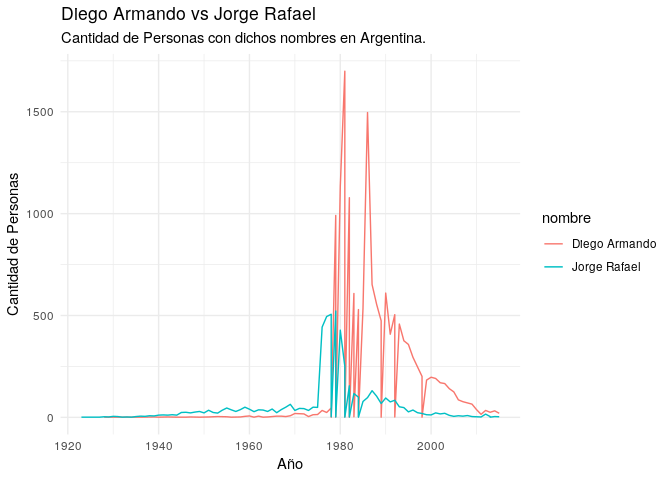

<!-- README.md is generated from README.Rmd. Please edit that file -->

# nombredepersonas

Nombre de Personas es un paquete que contiene los nombres registrados en
el Registro Nacional de las Personas agrupados por año. La información
surge de los puestos de toma de trámites del DNI en todo el país,
incluyendo argentinos y extranjeros nacionalizados.

Paquete inspirado en
(babynames)\[<https://github.com/hadley/babynames>\] con datos obtenidos
de:
(<https://datos.gob.ar/dataset/otros-nombres-personas-fisicas>)\[<https://datos.gob.ar/dataset/otros-nombres-personas-fisicas>\]

## Instalación

``` r
# Install the development version from GitHub
devtools::install_github("pdelboca/nombredepersonas")
```

## Ejemplo

Porqué existe este paquete? Basicamente porque puedo hacerlo :)

Para qué se podría utilzar?

### Generador aleatorio de nombres

``` r
library(nombredepersonas)

nombres[sample(nrow(nombres), 1), "nombre"]
#> # A tibble: 1 x 1
#>   nombre         
#>   <chr>          
#> 1 Yessica Sabrina
```

``` r
nombres[sample(nrow(nombres), 5), "nombre"]
#> # A tibble: 5 x 1
#>   nombre          
#>   <chr>           
#> 1 Milenka Yael    
#> 2 Norberto Sandro 
#> 3 Felisa del Pilar
#> 4 Facundo Dario   
#> 5 Enzo Hussein
```

### Generador aleatorio de nombres con precisión histórica

``` r
nombres %>%
  filter(anio == 1976) %>% 
  sample_n(3) %>% 
  select(nombre)
#> # A tibble: 3 x 1
#>   nombre       
#>   <chr>        
#> 1 Ezequiel Ivan
#> 2 Sonia Pamela 
#> 3 Uriel Dario
```

### Notas de color como saber qué nombre fue más usado en un año en particular

``` r
nombres %>% 
  filter(anio == 1987) %>% 
  arrange(desc(cantidad)) %>% 
  head()
#> # A tibble: 6 x 3
#>    anio nombre          cantidad
#>   <dbl> <chr>              <dbl>
#> 1  1987 Maria Belén         3958
#> 2  1987 Juan Pablo          3884
#> 3  1987 Juan Manuel         3508
#> 4  1987 Miguel Angel        3424
#> 5  1987 Jose Luis           3418
#> 6  1987 Maria Florencia     3232
```

### Algún gráfico con nombres históricos

``` r
library(ggplot2)

nombres %>% 
  filter(nombre %in% c("Diego Armando", "Jorge Rafael")) %>% 
  ggplot() +
  aes(x=anio, y=cantidad, color=nombre) +
  geom_line() +
  theme_minimal() +
  labs(title="Diego Armando vs Jorge Rafael",
       subtitle="Cantidad de Personas con dichos nombres en Argentina.",
       y="Cantidad de Personas", x="Año")
```


